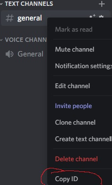

# Discord-raider-py
Easy way to raid a discord server.

<h1>Discord raid py</h1>

What i need to raid server?!?!?! 
You gonna need some tokens.

Invite code ONLY CODE! EX -> https://discord.gg/NeverGonnaGiveUp To -> <strong>NeverGonnaGiveUp</strong>. 
Chanel id

